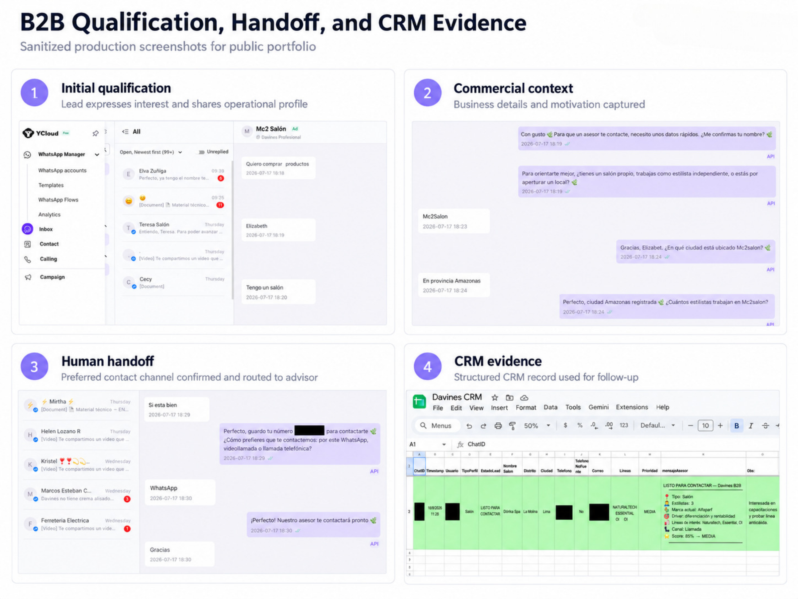
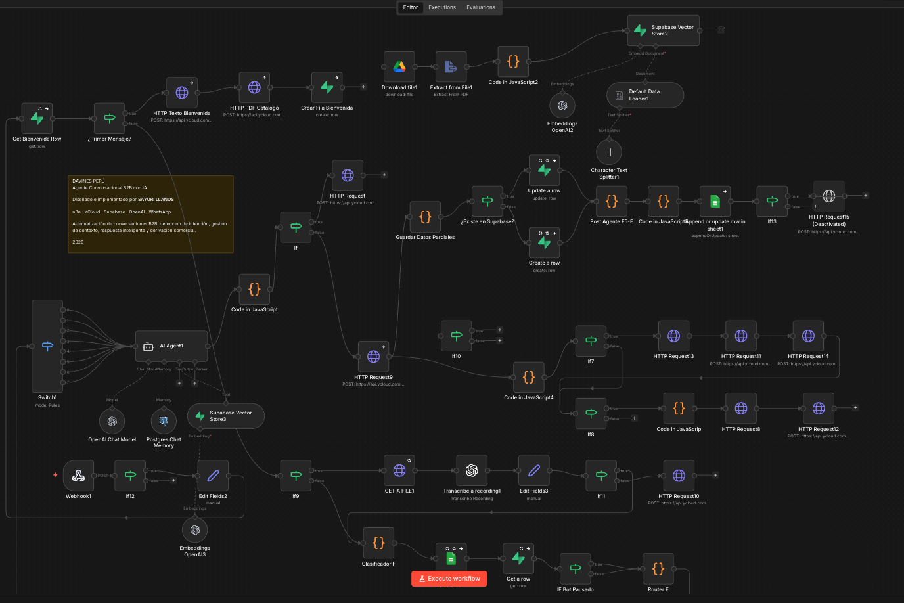
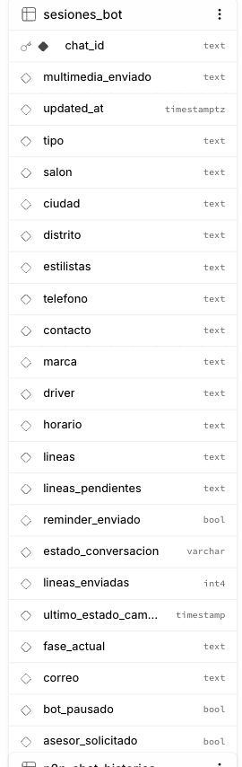
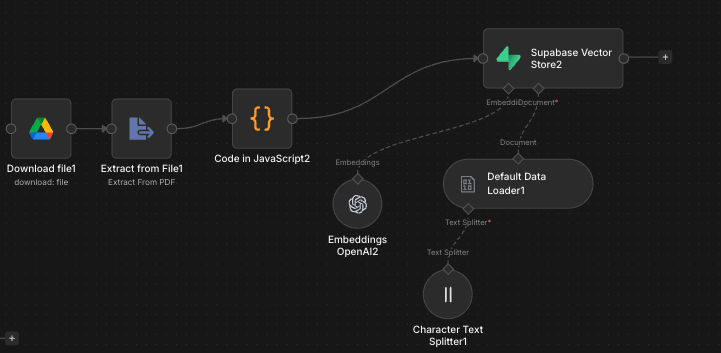
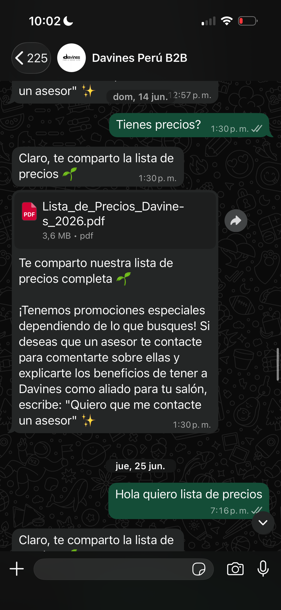
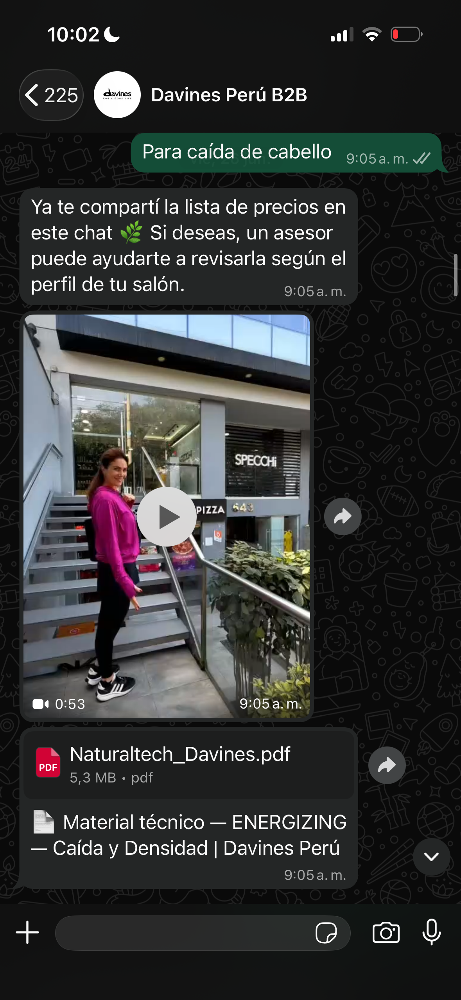
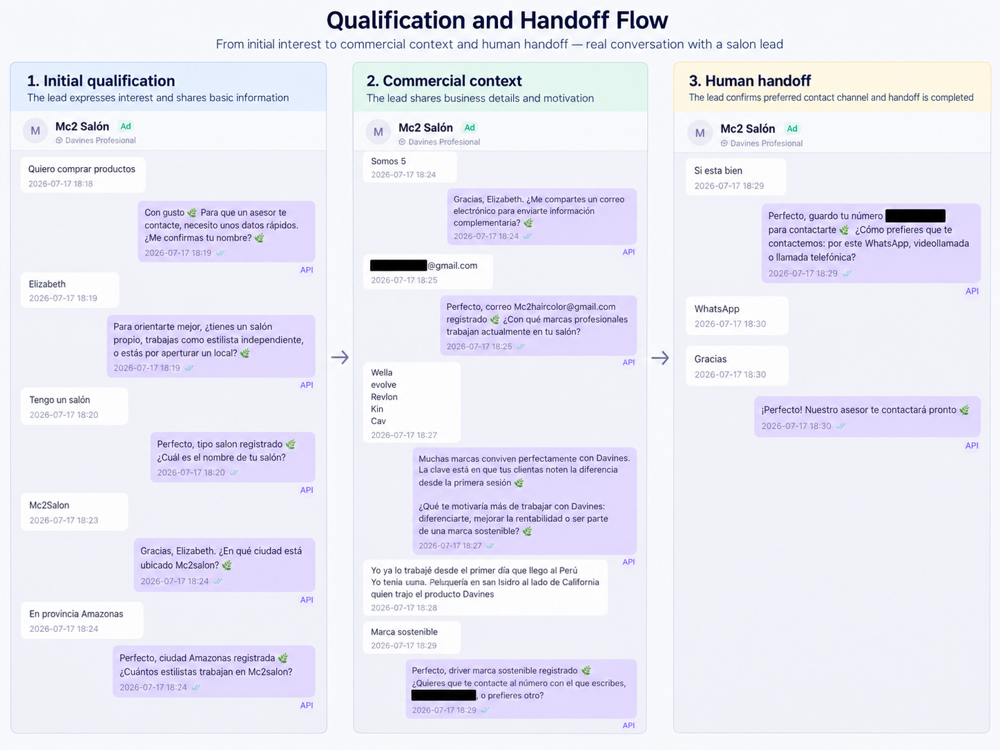
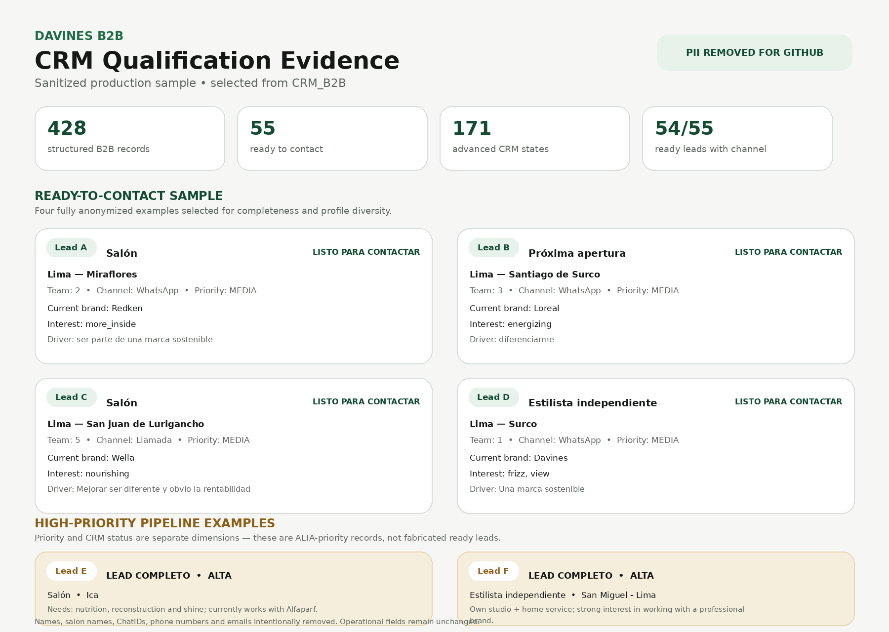
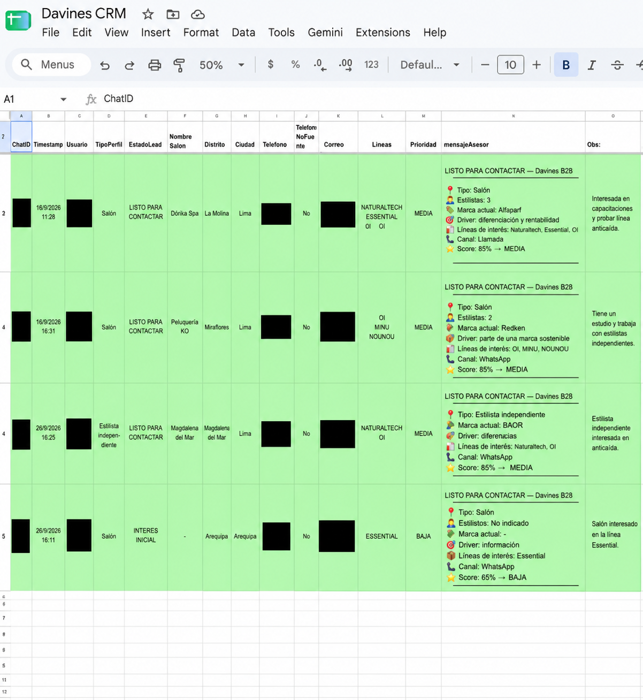
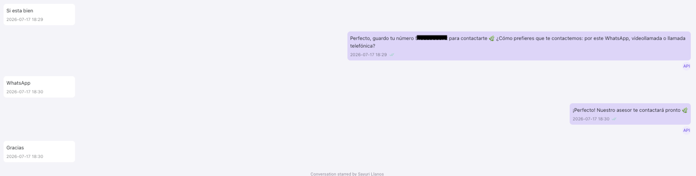

# Davines B2B — WhatsApp AI Sales & Qualification System

**Production B2B conversational system designed and implemented by Sayuri Llanos.**

A stateful WhatsApp sales and qualification system built for a professional beauty B2B journey.

The system connects paid acquisition with conversational AI, product education, structured qualification, persistent state, RAG, multimedia delivery, an operational CRM and human sales follow-up.

It was designed around a real commercial problem: professional prospects could arrive through digital acquisition while sales representatives also needed to spend time on field activity and in-person commercial follow-up.

The automation prepares the opportunity before human involvement.

---

## Production case study

> **Personal technical case study documenting my implementation work.**

> **This is not an official Davines open-source repository.**



This case study documents a production B2B WhatsApp system connecting conversational AI, deterministic routing, persistent state, product knowledge, progressive lead qualification, CRM operations and human sales follow-up.

---

```text

Meta Ads

    ↓

WhatsApp

    ↓

YCloud

    ↓

n8n

    ↓

Intent classification

    ↓

Persistent conversation state

    ↓

Product education / RAG

    ↓

B2B qualification

    ↓

Operational CRM

    ↓

Human validation

    ↓

Sales follow-up

```

---

## The problem

The B2B acquisition journey involved professional prospects such as:

- salons

- independent stylists

- upcoming salon openings

- larger professional accounts

Prospects could enter WhatsApp with very different levels of knowledge and intent.

Some needed to understand the Davines brand.

Others had technical questions about professional hair needs or product lines.

Others wanted pricing, catalogs or commercial information.

And some were already ready to speak with sales.

Sending every inbound conversation immediately to a salesperson creates several problems:

```text

Repeated product questions

        +

Repeated qualification questions

        +

Unstructured lead information

        +

Salespeople with limited time for inbound chat

```

The system was built to handle that conversational work before the commercial team needed to intervene.

---

## What I built

I designed and implemented the B2B conversational automation layer end-to-end.

My work included:

- mapping the commercial journey with marketing and sales context

- designing the B2B conversation flow

- building the n8n workflow

- integrating WhatsApp through YCloud

- implementing intent classification

- designing deterministic, state-aware routing

- building persistent conversation state with Supabase

- creating progressive B2B qualification logic

- implementing RAG for technical and commercial knowledge

- preparing and structuring knowledge sources

- implementing embeddings and vector retrieval

- handling product-line and hair-need detection

- implementing multimedia and document delivery

- building the Google Sheets operational CRM

- designing human handoff and bot-pause behavior

- implementing structured data extraction and persistence

- testing conversational edge cases

- debugging production failures

- performing regression and torture testing

- hardening credential and publication security

The AI model was one component of the system rather than the entire application.

```text

Language model

        ↓

Natural-language flexibility

Deterministic routing

        ↓

Business rules

Supabase

        ↓

Application state

RAG

        ↓

Domain knowledge

CRM

        ↓

Commercial operations

Human sales

        ↓

Relationship and close

```

---

## Core capabilities

### Conversational product education

The assistant can support conversations involving:

```text

Brand information

Professional product lines

Hair needs

Technical product questions

Product usage

Commercial questions

Pricing context

```

It can also deliver relevant:

```text

Catalogs

PDFs

Images

Videos

Product material

```

according to conversation context.

### Intent classification

A deterministic classifier identifies important categories before the final route is selected.

Examples include:

```text

INFORMACION

INFO_GENERAL

MULTIMEDIA

PRECIOS

TRABAJAR_MARCA

B2C

CLIENTE_ACTUAL

CADENA_DISTRIBUIDOR

SOPORTE

```

### State-aware routing

The system does not decide behavior from the current message alone.

```text

Current message

        +

Intent

        +

Supabase state

        +

Commercial context

        +

Previously delivered material

        +

Handoff state

        ↓

Final route

```

This allows the same short message to be interpreted differently depending on the current conversation phase.

### Progressive qualification

Qualification happens across multiple WhatsApp turns rather than through a rigid form.

The system can progressively capture information such as:

```text

Professional profile

Salon

City

District

Number of stylists

Phone

Email

Current professional brand

Commercial motivation

Product interests

Preferred contact channel

```

Already captured fields are persisted so the assistant does not need to repeatedly ask for them.

### Persistent state

Supabase stores business-critical application state independently from the language model.

Relevant state includes:

```text

fase_actual

estado_conversacion

estado

bot_pausado

asesor_solicitado

tipo

salon

ciudad

distrito

estilistas

telefono

correo

contacto

marca

driver

horario

lineas

lineas_pendientes

multimedia_enviado

```

### Retrieval-Augmented Generation

The assistant uses a curated knowledge architecture rather than relying only on the model's general knowledge.

Three major knowledge categories were prepared:

```text

Technical Davines knowledge

+

B2B commercial knowledge

+

B2B qualification knowledge

```

The ingestion architecture follows:

```text

Source documents

        ↓

Preparation / cleanup

        ↓

Text extraction

        ↓

Chunking

        ↓

OpenAI embeddings

        ↓

Supabase Vector Store

        ↓

Semantic retrieval

        ↓

AI Agent

```

### Operational CRM

Qualified and partially qualified commercial information is also transformed into a human-readable Google Sheets CRM.

The CRM acts as a commercial operations layer rather than the source of live conversation state.

```text

Supabase

        ↓

Machine / application state

Google Sheets

        ↓

Human-reviewed commercial operations

```

The production CRM snapshot analyzed for this case study contained **428 structured B2B records** at different levels of commercial progression.

### Human-in-the-loop sales handoff

The assistant was not designed to replace the salesperson.

It was designed to prepare the opportunity.

```text

AI conversation

        ↓

Product education

        ↓

Qualification

        ↓

Structured context

        ↓

Human validation

        ↓

Sales team

```

Human handoff is persisted as application state through fields including:

```text

estado = HUMANO

asesor_solicitado = true

bot_pausado = true

```

This prevents the normal acquisition flow from blindly restarting after commercial ownership changes.

---

## Production architecture

```text

                         META ADS

                             ↓

                         WHATSAPP

                             ↓

                          YCLOUD

                             ↓

                        N8N WEBHOOK

                             ↓

                    INPUT NORMALIZATION

                       │           │

                      TEXT       AUDIO

                                   ↓

                               TRANSCRIPTION

                       │           │

                       └─────┬─────┘

                             ↓

                       CLASIFICADOR F

                             ↓

                     SUPABASE SESSION

                             ↓

                         ROUTER F

                             ↓

             ┌───────────────┼───────────────┐

             │               │               │

      CONVERSATION          RAG       QUALIFICATION

             │               │               │

             │       SUPABASE VECTOR         │

             │               │               │

             └───────────────┼───────────────┘

                             ↓

                         AI AGENT

                             ↓

                     STRUCTURED DATA

                             ↓

                   SUPABASE PERSISTENCE

                             ↓

                    GOOGLE SHEETS CRM

                             ↓

                       HUMAN REVIEW

                             ↓

                        SALES TEAM

Outbound response:

AI / Router

     ↓

n8n

     ↓

YCloud

     ↓

WhatsApp

```

### Production workflow



The production workflow orchestrates WhatsApp messaging, deterministic routing, AI reasoning, application state, RAG retrieval, CRM persistence and human escalation.

### Persistent conversation state



Conversation state is persisted outside the language model so the system can preserve qualification progress, delivery history and handoff status across multiple WhatsApp turns.

### RAG knowledge pipeline



Technical and commercial knowledge is prepared, embedded and stored for contextual retrieval during conversations.

---

## Stack

| Layer | Technology |

|---|---|

| Workflow orchestration | n8n |

| Messaging | WhatsApp / YCloud |

| Conversational AI | OpenAI |

| Audio | OpenAI transcription |

| Application state | Supabase |

| Vector retrieval | Supabase Vector Store |

| Embeddings | OpenAI Embeddings |

| Conversation memory | PostgreSQL-backed chat memory |

| Knowledge source storage | Google Drive |

| Operational CRM | Google Sheets |

| Acquisition | Meta Ads |

---

## Production evidence

Different metrics represent different layers and periods of the system and should not be treated as one linear funnel.

### Real WhatsApp execution

<table>

<tr>

<td width="50%" align="center">

<strong>Price-list delivery</strong>



</td>

<td width="50%" align="center">

<strong>Context-aware product material</strong>



</td>

</tr>

</table>

### Qualification → human handoff



The system progressively captures commercial context instead of forcing prospects through a rigid form, then transfers qualified conversations to human sales follow-up.

### CRM operations



### Raw sanitized production evidence

The following screenshots preserve the appearance of the operational tools while removing sensitive identifiers.



<br><br>



### Supabase state snapshot

The analyzed production snapshot contained:

**803 persisted conversation sessions**

| State | Sessions |

|---|---:|

| Exploration + active | 697 |

| Capture + active | 45 |

| Capture + human follow-up | 35 |

| Exploration + human follow-up | 26 |

| **Total** | **803** |

The same snapshot contained **61 sessions in persistent human-handoff state**.

These numbers describe application state, not total historical conversation volume or closed sales.

### Operational CRM snapshot

The analyzed B2B CRM contained:

**428 structured B2B records**

| CRM status | Records |

|---|---:|

| INTERÉS INICIAL | 229 |

| LEAD PARCIAL | 28 |

| LEAD COMPLETO | 116 |

| LISTO PARA CONTACTAR | 55 |

| **Total** | **428** |

The CRM and Supabase datasets serve different purposes and should not be interpreted as a direct `428 / 803` conversion rate.

### Broader B2B performance — May to July 2026

Across the broader B2B acquisition channel operating alongside the automation:

| Metric | Result |

|---|---:|

| B2B conversations | 878 |

| New account openings | 18 |

| Sales | S/57.9K |

| Meta Ads spend | S/2.35K |

| Blended ROAS | 24.7x |

### High-performance campaign period

One analyzed campaign period recorded:

| Metric | Result |

|---|---:|

| ROAS | \\~41x |

| Meta Ads spend | S/836 |

| Attributed sales | S/34,571 |

| New commercial openings | \\~3 → 10 in one month |

Lead qualification time was also reduced from hours to minutes.

### Attribution

These commercial results should **not** be attributed exclusively to the AI assistant.

Performance depended on the complete GTM system:

```text

Advertising

+

Creative

+

Conversational automation

+

Product / commercial offer

+

Human validation

+

Sales execution

```

My primary technical ownership was the AI and automation layer connecting WhatsApp acquisition with product education, qualification, persistent state, CRM operations and human handoff.

---

## QA and production hardening

The workflow was tested beyond happy-path demos.

QA included:

- professional vs consumer ambiguity

- short one-word qualification replies

- typos and geographic normalization

- product-line false positives

- multiple simultaneous product needs

- corrections to previously captured information

- pricing behavior

- duplicate multimedia prevention

- existing-client behavior

- human handoff

- post-handoff messages

- audio

- state persistence

- CRM persistence

The historical QA process included an initial **46-conversation torture-test baseline** that identified **7 P0 bugs and 2 structural findings**, followed by targeted fixes, regression testing, expanded reconciliation and STAGING end-to-end validation.

The testing methodology evolved from:

```text

Try conversation

→ edit prompt

→ try again

```

toward:

```text

Reproduce

→ classify severity

→ trace workflow

→ identify root cause

→ minimal fix

→ targeted test

→ regression

→ E2E validation

```

---

## Key engineering decisions

### Deterministic routing + AI

The system avoids giving the language model complete control over commercial workflow decisions.

AI handles flexible language.

Code handles:

```text

Routing priorities

State transitions

Qualification continuity

Anti-repetition

Handoff control

Data protection

```

### Separate conversation memory from business state

```text

PostgreSQL chat memory

        ↓

What was said?

Supabase sesiones_bot

        ↓

What does the application know?

Supabase documents

        ↓

What does the system know about Davines?

```

### Human-in-the-loop instead of maximum automation

The objective was not to automate the final commercial relationship.

The system automates repetitive conversational work while preserving human judgment for sales.

### Operational adoption over unnecessary complexity

Google Sheets was intentionally used as the lightweight commercial CRM because it matched the team's actual operating workflow.

The architecture can later migrate the same structured lead model to a dedicated CRM without redesigning the conversational system.

---

## Documentation

The repository documents the system from business problem to production operation.

| Document | Topic |

|---|---|

| [`01-problem.md`](docs/01-problem.md) | Business problem |

| [`02-architecture.md`](docs/02-architecture.md) | System architecture |

| [`03-decisions.md`](docs/03-decisions.md) | Engineering decisions |

| [`04-qa-testing.md`](docs/04-qa-testing.md) | Initial QA overview |

| [`05-build-log.md`](docs/05-build-log.md) | System evolution |

| [`06-results.md`](docs/06-results.md) | Commercial results |

| [`07-data-model.md`](docs/07-data-model.md) | Production data model |

| [`08-supabase-state.md`](docs/08-supabase-state.md) | Conversation state machine |

| [`09-operational-crm.md`](docs/09-operational-crm.md) | CRM and human review |

| [`10-conversation-routing.md`](docs/10-conversation-routing.md) | Classification and routing |

| [`11-rag-knowledge.md`](docs/11-rag-knowledge.md) | RAG and knowledge architecture |

| [`12-human-handoff.md`](docs/12-human-handoff.md) | Sales escalation |

| [`13-integrations.md`](docs/13-integrations.md) | Integrations and data flow |

| [`14-security.md`](docs/14-security.md) | Security and publication hygiene |

| [`15-production-runbook.md`](docs/15-production-runbook.md) | Production troubleshooting |

| [`16-qa-deep-dive.md`](docs/16-qa-deep-dive.md) | QA, torture testing and regression |

---

## Build evolution

The system evolved through several stages.

```text

Basic WhatsApp automation

        ↓

Deterministic intent classification

        ↓

Persistent Supabase state

        ↓

Product / technical RAG

        ↓

Progressive B2B qualification

        ↓

Operational CRM

        ↓

Human handoff

        ↓

Production QA

        ↓

Security and reliability hardening

```

The final architecture was shaped by real production behavior rather than being designed once and left unchanged.

---

## Public-safe workflow

A sanitized structural snapshot of the production workflow is available for technical inspection:

[`portfolio/davines-b2b-public-safe.json`](portfolio/davines-b2b-public-safe.json)

The public-safe artifact preserves:

- workflow topology

- node types

- routing architecture

- state-management structure

- RAG components

- CRM integration

- human-handoff paths

Production credentials, private identifiers, customer data and executable private business logic are intentionally removed.

See [`portfolio/README.md`](portfolio/README.md) for the sanitization scope.


## Security and evidence policy

The original production artifact is intentionally **not committed publicly** because production workflows and supporting data may contain:

```text

Credentials

Private URLs

Internal identifiers

Customer information

Commercial data

Private knowledge sources

```

A SHA-256 fingerprint of the original production workflow is stored at:

`evidence/2026-09-08-original.sha256`

Recorded artifact fingerprint:

`f438ed58d419696112d2eb5605208eb7f505f06a2562e616023aa08bd2ef0668`

The fingerprint preserves artifact-integrity evidence without exposing the private production export.

A hash demonstrates correspondence with a specific artifact; it does not by itself establish authorship or intellectual-property ownership.

Before any workflow is published, it should be sanitized to remove:

- API credentials

- customer PII

- private webhook URLs

- production phone numbers

- internal document IDs

- database identifiers that do not need to be public

- raw conversation data

- private commercial source material

---

## Repository philosophy

This repository intentionally documents not only the final result but also:

```text

Why the system exists

How it works

What state it stores

How it retrieves knowledge

How it routes conversations

How it hands leads to humans

How it failed

How it was tested

How it was debugged

How production evidence is protected

```

The goal is to document the engineering process behind the production system rather than present only screenshots or outcome metrics.

---

## Author

**Sayuri Llanos**

AI Automation · GTM Systems · Conversational AI

This repository documents my implementation work on the B2B conversational automation layer and clearly separates shared marketing / sales outcomes from my technical contribution.
