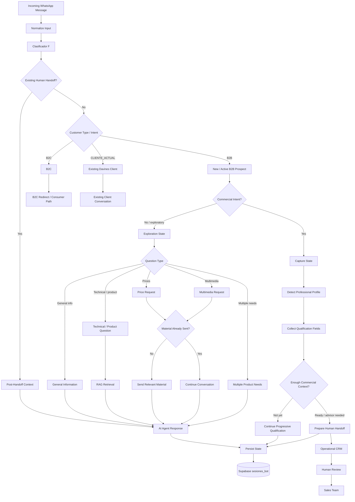
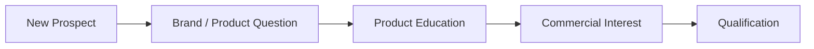
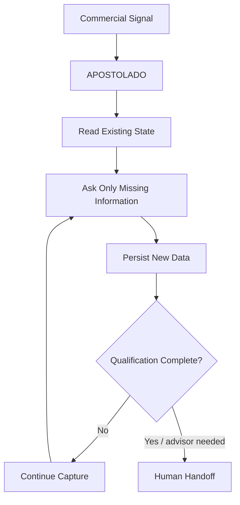
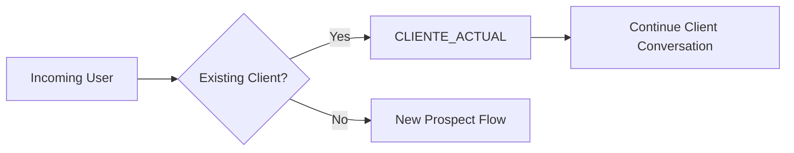
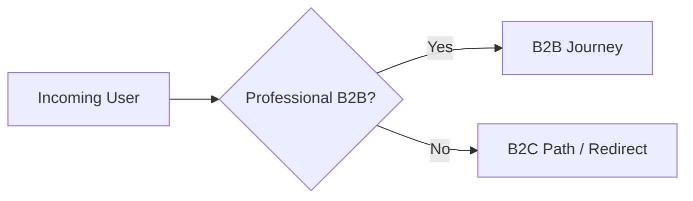
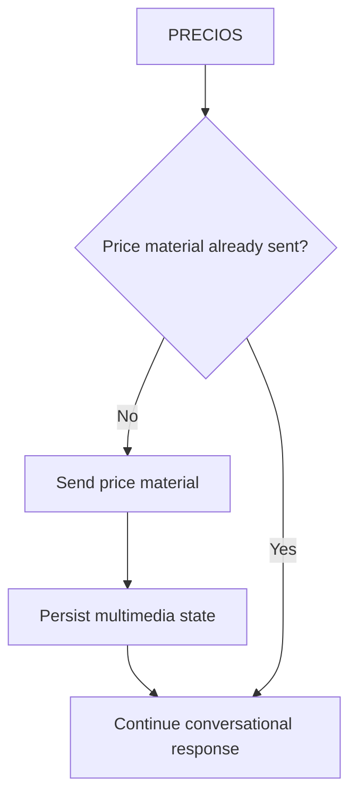
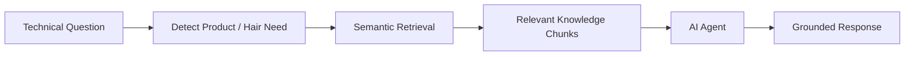
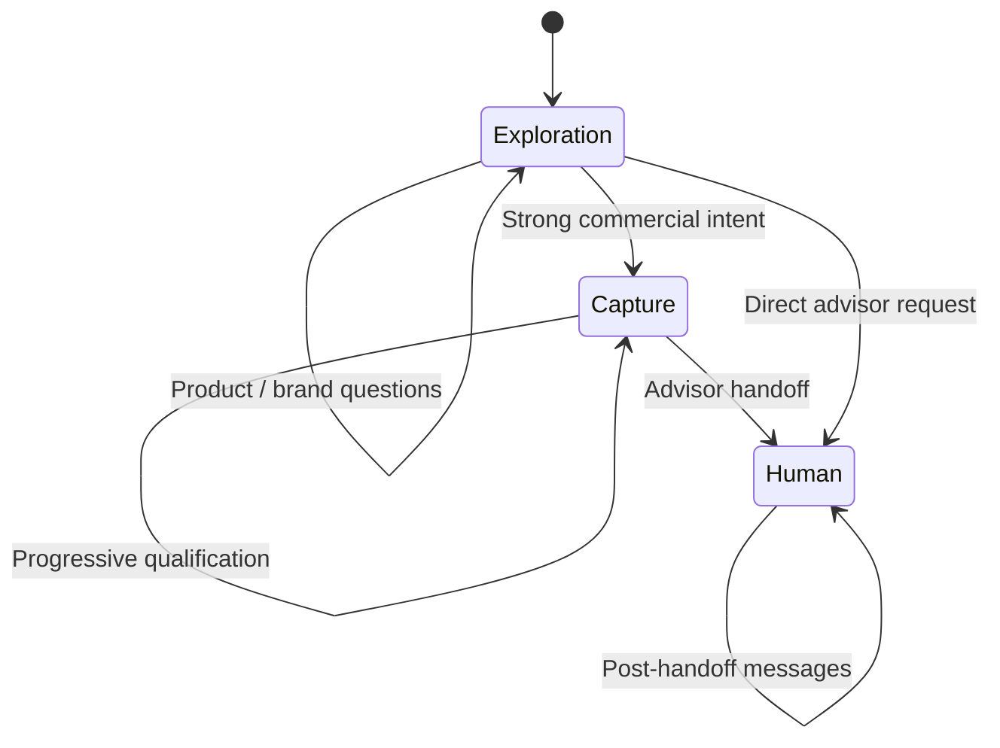

# Conversation Flow and State Transitions

This diagram summarizes how the B2B WhatsApp system moves between exploration, qualification and human commercial follow-up.

The routing decision is based on:

```text
Current message
+
Intent classification
+
Previous Supabase state
+
Commercial context
+
Previously delivered material
+
Handoff state
```



## Main conversation phases

The production workflow uses two main commercial phases:

```text
exploracion
captura
```

and a separate human-ownership state:

```text
HUMANO
```

These represent different responsibilities.

### Exploration

```text
fase_actual = exploracion
```

The user may still be:

- learning about Davines
- asking product questions
- comparing professional lines
- requesting technical information
- requesting pricing
- receiving catalogs or multimedia
- clarifying whether Davines fits their business

The goal is not to force qualification too early.

### Capture

```text
fase_actual = captura
```

The conversation has moved into structured commercial qualification.

Possible fields include:

```text
tipo
salon
ciudad
distrito
estilistas
telefono
correo
contacto
marca
driver
horario
lineas
```

The assistant collects this information progressively across multiple turns.

### Human ownership

```text
estado = HUMANO
asesor_solicitado = true
bot_pausado = true
```

This represents commercial escalation.

The important distinction is:

```text
AI says "an advisor will contact you"
```

is not enough.

The workflow must also persist the handoff state.

---

## Exploration path

A new B2B prospect normally begins in exploration.



Not every conversation reaches qualification.

A prospect may:

```text
Ask one question
Receive information
Stop responding
```

That is still a valid conversational outcome.

---

## Qualification path

When commercial intent becomes stronger:

```text
TRABAJAR_MARCA
advisor request
visit request
professional onboarding interest
strong B2B buying intent
```

the system can move toward:

```text
APOSTOLADO
        ↓
captura
```

Conceptually:



---

## Short-answer handling

During capture, short answers need to be interpreted using conversation state.

Example:

```text
Bot:
¿En qué ciudad estás?

User:
Lima
```

Outside qualification, `"Lima"` may have little meaning.

Inside capture:

```text
fase_actual = captura
+
previous question = city
        ↓
ciudad = Lima
```

This is why persistent state has higher importance than isolated-message interpretation.

---

## Correction handling

Users can change previously supplied information.

Example:

```text
User:
Estoy en Lima.

Later:
Perdón, estoy en Trujillo.
```

Expected transition:

```text
ciudad = Lima
        ↓
correction detected
        ↓
ciudad = Trujillo
```

The new value should replace the old value without deleting unrelated qualification fields.

---

## Profile correction

Changing professional profile may require clearing incompatible information.

Example:

```text
Old state:

tipo = salon
salon = Studio Example
estilistas = 6
```

User correction:

```text
"En realidad trabajo de manera independiente."
```

Expected:

```text
tipo = independiente
salon = null
estilistas = null
```

The goal is consistent state rather than preserving contradictory fields.

---

## Existing client path

Existing Davines clients should not be treated as brand-new acquisition prospects.



This prevents unnecessary:

```text
introductory qualification
catalog repetition
price repetition
new-lead treatment
```

---

## B2C separation

The B2B workflow also needs to detect consumer traffic.



This protects CRM quality and prevents consumers from entering professional qualification.

---

## Price behavior

Price requests are state-aware.



This reduces unnecessary repeated file delivery.

---

## Multimedia behavior

The same principle applies to catalogs, PDFs, images and videos.

```text
User request
        ↓
Relevant material?
        ↓
Already sent?
        │
        ├── No → send
        └── Yes → continue without unnecessary repetition
```

Delivery state is persisted using:

```text
multimedia_enviado
```

---

## RAG path

Technical and product questions can invoke knowledge retrieval.



RAG provides domain context.

It does not decide the commercial state machine.

---

## Multiple needs

A customer can express more than one product need in the same message.

Example:

```text
"I need something for frizz, curls and hair loss."
```

The workflow can track:

```text
current need
+
lineas_pendientes
```

Conceptually:

```text
Need 1
    ↓
Answer / recommend
    ↓
Pending Need 2
    ↓
Answer / recommend
    ↓
Pending Need 3
```

This prevents secondary needs from disappearing after the first recommendation.

---

## Human handoff

Handoff occurs when the conversation should move from automated qualification toward commercial ownership.



Observed production data showed both:

```text
captura → HUMANO
```

and:

```text
exploracion → HUMANO
```

which means some conversations escalated directly without completing the idealized capture path.

The documentation preserves this observed behavior rather than forcing every session into a theoretical funnel.

---

## State transition summary

```text
NEW
 ↓
EXPLORACION
 │
 ├── General information
 ├── Product education
 ├── RAG
 ├── Pricing
 ├── Multimedia
 └── Commercial intent
          ↓
       CAPTURA
          │
          ├── profile
          ├── location
          ├── contact
          ├── current brand
          ├── commercial driver
          └── product interests
                   ↓
                HUMANO
                   ↓
             CRM + Sales
```

Parallel exits:

```text
B2C
    ↓
Consumer path

CLIENTE_ACTUAL
    ↓
Existing-client conversation
```

---

## Core engineering principle

Conversation flow is not controlled by the language model alone.

```text
Message meaning
        +
Persistent state
        +
Deterministic rules
        +
Commercial context
        ↓
Behavior
```

This prevents the application from depending entirely on whether the model "remembers" what should happen next.

---

## Privacy

This diagram uses synthetic examples and architectural labels only.

No customer conversations, phone numbers, emails, credentials or private production identifiers are included.
