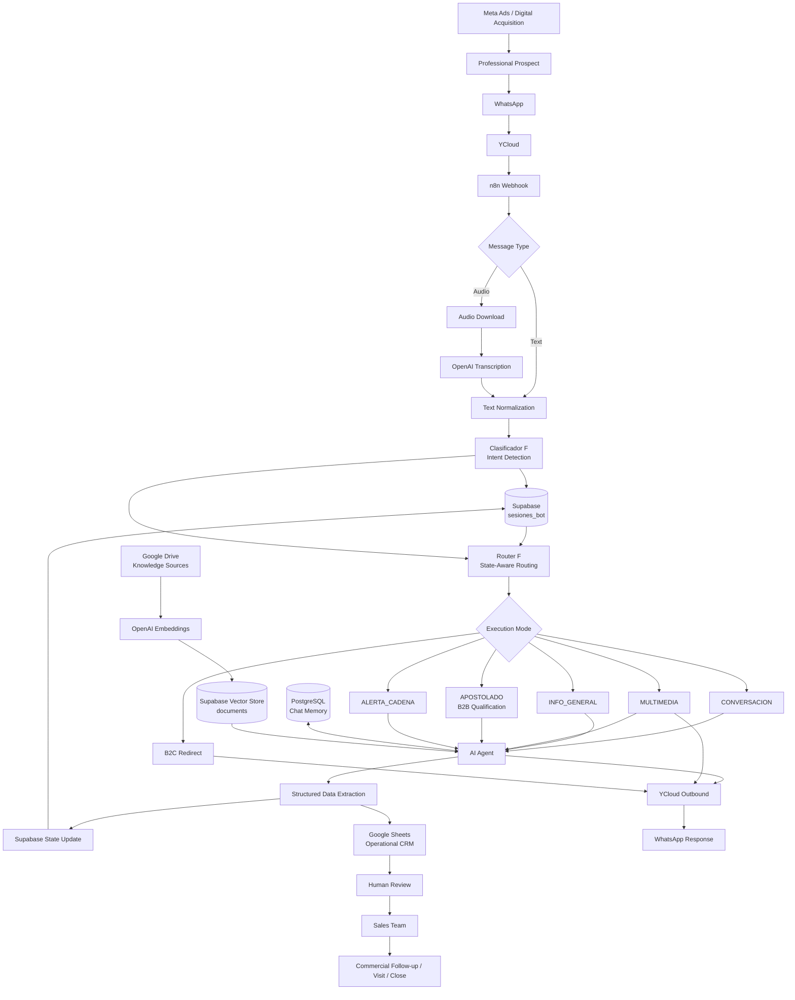

# System Architecture Overview

This diagram summarizes the production architecture of the Davines B2B WhatsApp AI sales and qualification system.

The system separates acquisition, messaging, workflow orchestration, conversational intelligence, persistent state, domain knowledge, commercial operations and human sales.



## Responsibility boundaries

The architecture intentionally assigns different responsibilities to different components.

| Layer | Responsibility |
|---|---|
| Meta Ads | Generate professional B2B demand |
| WhatsApp / YCloud | Customer messaging transport |
| n8n | Workflow orchestration |
| `Clasificador F` | Initial intent detection |
| `Router F` | Contextual business decision-making |
| OpenAI | Conversation, extraction, transcription and embeddings |
| Supabase `sesiones_bot` | Persistent application and qualification state |
| PostgreSQL chat memory | Natural conversation history |
| Supabase `documents` | Semantic knowledge retrieval |
| Google Drive | Source knowledge documents |
| Google Sheets | Human-readable operational CRM |
| Marketing / human review | Validate and enrich opportunities |
| Sales team | Commercial follow-up and closing |

## Core architectural principle

The system does not treat the language model as the entire application.

```text
Natural-language intelligence
        +
Deterministic routing
        +
Persistent application state
        +
Domain knowledge
        +
Operational CRM
        +
Human commercial execution
```

Each layer solves a different problem.

## Main runtime path

A typical prospect journey is:

```text
Meta Ad
    ↓
WhatsApp
    ↓
YCloud
    ↓
n8n
    ↓
Intent classification
    ↓
Existing Supabase state
    ↓
State-aware routing
    ↓
AI / RAG / multimedia / qualification
    ↓
Structured data
    ↓
Supabase persistence
    ↓
Operational CRM
    ↓
Human validation
    ↓
Sales follow-up
```

## Knowledge path

The knowledge architecture runs alongside the conversational flow.

```text
Technical knowledge
Commercial knowledge
Qualification knowledge
        ↓
Google Drive
        ↓
Document processing
        ↓
Chunking
        ↓
OpenAI Embeddings
        ↓
Supabase Vector Store
        ↓
Relevant retrieved context
        ↓
AI Agent
```

## Memory separation

Three different forms of memory are intentionally separated:

```text
PostgreSQL chat memory
        ↓
What has been said?


Supabase sesiones_bot
        ↓
What does the application know about this lead?


Supabase documents
        ↓
What does the system know about Davines?
```

This separation is fundamental to the architecture.

## Commercial handoff

Human handoff is an application transition rather than only a conversational phrase.

```text
Commercial intent
        ↓
Qualification
        ↓
Structured lead state
        ↓
estado = HUMANO
asesor_solicitado = true
bot_pausado = true
        ↓
CRM
        ↓
Human review
        ↓
Sales team
```

## Security boundary

Production credentials, customer data and private knowledge sources are intentionally excluded from this architectural representation.

The diagram documents system behavior without exposing:

```text
API keys
Customer PII
Private URLs
Database credentials
Internal file IDs
Raw conversation history
```